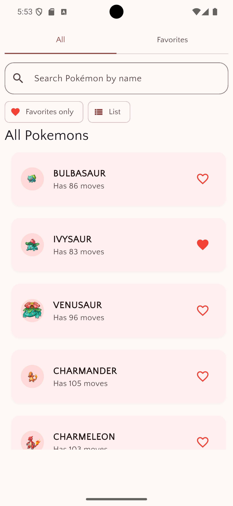
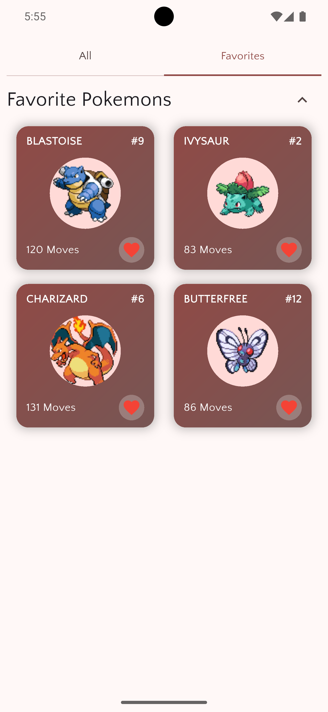
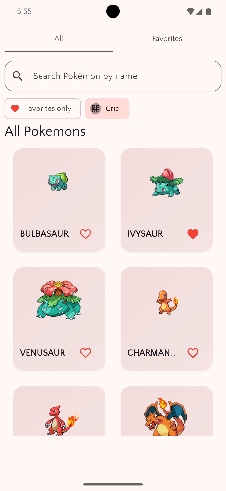
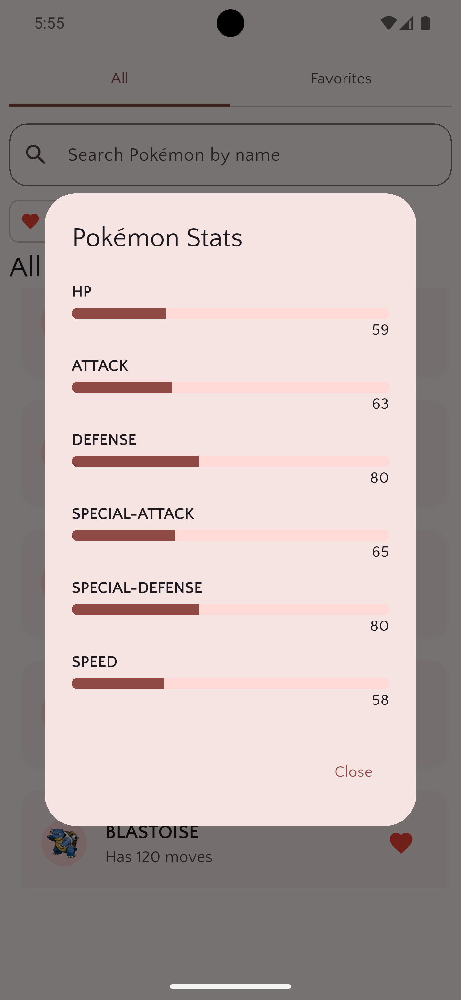

# 🎮 Pokédex App

A beautiful and modern Flutter Pokédex application built with Riverpod for state management. This app allows users to browse, search, and favorite their beloved Pokémon with a clean and intuitive interface.

## ✨ Features

- 📱 **Modern UI Design** - Clean and intuitive interface with Material Design
- 🔍 **Search Functionality** - Search Pokémon by name
- ❤️ **Favorites System** - Save your favorite Pokémon locally
- 📊 **Detailed Stats** - View complete Pokémon statistics
- 🎯 **Multiple View Modes** - Switch between list and grid views
- 💾 **Persistent Storage** - Favorites are saved using SharedPreferences
- ⚡ **State Management** - Built with Riverpod for efficient state management

## 📱 Screenshots

<div align="center">
  
  
  
  
</div>

## 🛠️ Built With

- **Flutter** `3.35.2` - UI framework
- **Riverpod** `^2.6.1` - State management
- **Dio** `^5.9.0` - HTTP client for API calls
- **Google Fonts** `^6.3.1` - Custom typography
- **GetIt** `^8.2.0` - Service locator
- **Skeletonizer** `^2.1.0+1` - Loading animations
- **SharedPreferences** `^2.5.3` - Local data persistence

## 🚀 Getting Started

### Prerequisites

- Flutter SDK `3.35.2` or higher
- Dart SDK
- Android Studio / VS Code
- Android/iOS device or emulator

### Installation

1. **Clone the repository**
   ```bash
   git clone https://github.com/OnoPUNPUN/poke_buddy.git
   cd poke_buddy
   ```

2. **Install dependencies**
   ```bash
   flutter pub get
   ```

3. **Run the app**
   ```bash
   flutter run
   ```

## 🏗️ Architecture

This app follows clean architecture principles with Riverpod for state management:

```
lib/
├── controllers/
│   └── home_page_controller.dart
├── models/
│   ├── page_data.dart
│   └── pokemon.dart
├── providers/
│   └── pokemon_data_providers.dart
├── screens/
│   └── home_screen.dart
├── services/
│   ├── database_service.dart
│   └── http_service.dart
├── widgets/
│   ├── pokemon_card.dart
│   ├── pokemon_grid_card.dart
│   ├── pokemon_list_tile.dart
│   └── pokemon_stats_dialogue.dart
└── main.dart
```

### Key Components

- **Providers**: Riverpod providers for state management
- **Models**: Data models for Pokémon entities
- **Services**: API services and local storage
- **Repositories**: Data layer abstraction
- **Widgets**: Reusable UI components

## 🎯 Key Learning Objectives

This project was created to learn and implement:

- ✅ **Riverpod State Management** - Understanding providers, consumers, and state
- ✅ **API Integration** - Consuming REST APIs with Dio
- ✅ **Local Storage** - Implementing persistent favorites
- ✅ **Clean Architecture** - Separating concerns and maintaining code quality
- ✅ **Responsive UI** - Creating adaptive interfaces
- ✅ **Error Handling** - Managing loading states and errors

## 📋 Features Breakdown

### 🏠 Home Screen
- Display all Pokémon in a clean list
- Search functionality with real-time filtering
- Toggle between list and grid views
- Heart icons for favoriting

### ❤️ Favorites
- Dedicated favorites tab
- Persistent storage of favorite Pokémon
- Quick access to beloved creatures
- Card-based layout with stats preview

### 📊 Pokémon Details
- Comprehensive stat display (HP, Attack, Defense, etc.)
- Visual stat bars with color coding
- Move count information
- Favorite toggle functionality

### 🔍 Search & Filter
- Real-time search as you type
- Filter by favorites only
- Smooth animations and transitions

## 🎨 Design Highlights

- **Material Design 3** principles
- **Custom color schemes** for better visual hierarchy
- **Smooth animations** and transitions
- **Responsive layouts** for different screen sizes
- **Skeleton loading** for better UX

## 🔮 Future Enhancements

- [ ] Pokémon type filtering
- [ ] Detailed Pokémon information screen
- [ ] Evolution chain display
- [ ] Offline support
- [ ] Theme switching (Light/Dark)
- [ ] Advanced search filters
- [ ] Pokémon comparison feature

## 🤝 Contributing

Contributions are welcome! Please feel free to submit a Pull Request. For major changes, please open an issue first to discuss what you would like to change.

1. Fork the project
2. Create your feature branch (`git checkout -b feature/AmazingFeature`)
3. Commit your changes (`git commit -m 'Add some AmazingFeature'`)
4. Push to the branch (`git push origin feature/AmazingFeature`)
5. Open a Pull Request

## 📄 License

This project is licensed under the MIT License - see the [LICENSE](LICENSE) file for details.

## 🙏 Acknowledgments

- [PokéAPI](https://pokeapi.co/) for providing the Pokémon data
- Flutter team for the amazing framework
- Riverpod community for excellent documentation
- All contributors who helped improve this project

## 📞 Contact

Feel free to reach out if you have any questions or suggestions!

- **GitHub**: [@OnoPUNPUN](https://github.com/OnoPUNPUN)
- **Email**: punpunonodera754@gmail.com

---

<div align="center">
  <p>Made with ❤️ and Flutter</p>
  <p>⭐ Star this repository if you found it helpful!</p>
</div>
